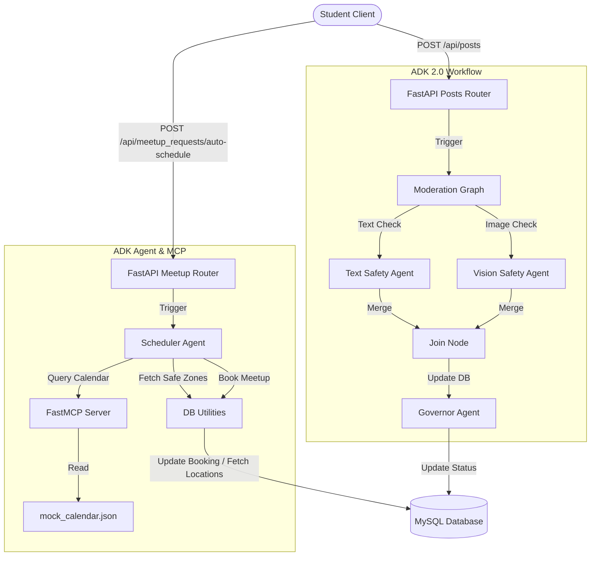

# GatorMart - SFSU Campus Marketplace (AI Extensions)

GatorMart is a student campus marketplace built for San Francisco State University. This folder contains the backend and frontend components of the application. 

As part of our hackathon submission and capstone evolution, we integrated two state-of-the-art AI agent features using the **Google Agent Development Kit (ADK) 2.0** and the **Model Context Protocol (MCP)**.

---

## 🌟 Key AI Agent Features

### 1. Parallel Multimodal Content Moderation
*   **Location**: `application/backend/app/agents/moderation_graph.py`
*   **Workflow**: When a student posts a listing, it is created with a `pending` status. A parallel graph workflow is triggered:
    *   **Text Node**: Evaluates the title and description against SFSU academic integrity policies (blocking exam leaks, homework help, illegal items, etc.).
    *   **Vision Node**: Evaluates the attached image (if present) for safety and compliance.
    *   **Join Node & Governor**: Merges the text and vision results. If compliant, updates `post_status` to `active`. If non-compliant, flags it as `denied` and logs the reason.
    *   **Resilience**: Gracefully falls back to passing and setting the listing `active` if model quotas are temporarily exhausted, ensuring the marketplace remains online.

### 2. Calendar-Aware Safe Meetup Scheduler (MCP)
*   **Location**: `application/backend/app/agents/scheduler_agent.py`
*   **MCP Server**: `application/backend/app/mcp/server.py`
*   **Workflow**: Buyer and seller students can coordinate transaction meetups:
    *   The scheduler agent queries the custom **FastMCP Calendar Server** via stdio to fetch buyer and seller mock calendar availability.
    *   The agent queries the MySQL database for SFSU campus-designated safe meetup locations (e.g. Cesar Chavez Student Center).
    *   It identifies overlapping available time slots within the buyer's preferred timeframe, suggests a specific time/location, and inserts the booking into the `meetup_requests` table with status `pending`.

---

## 🛠️ System Architecture



---

## 🚀 Setup & Execution Guide

### Prerequisites
*   Python 3.14 (or 3.10+)
*   MySQL Database instance running locally

### 1. Environment Configuration
Create a `.env` file in `application/backend/.env`:
```env
DB_HOST=127.0.0.1
DB_USER=team03
DB_PASSWORD=team03pass
DB_NAME=team03db
GEMINI_API_KEY=your_google_ai_studio_api_key
```

### 2. Dependency Setup
Navigate to the backend and configure the virtual environment:
```bash
cd application/backend
python -m venv .venv
source .venv/bin/activate
pip install -r requirements.txt
```

### 3. Running Integration & Standalone Tests
We have created three comprehensive test suites under the artifacts/scratch workspace:

*   **Test 1: Content Moderation**
    Verifies that textbook listings pass safety tests while exam answers leaks are correctly flagged and set to `denied` in the database:
    ```bash
    PYTHONPATH=. .venv/bin/python scratch/test_moderation.py
    ```

*   **Test 2: Calendar MCP Scheduling**
    Verifies that the agent spawns the FastMCP stdio server, parses busy slots for users, fetches locations, and triggers DB writes:
    ```bash
    PYTHONPATH=. .venv/bin/python scratch/test_scheduler.py
    ```

*   **Test 3: Full API Integration Test**
    Boots FastAPI in-memory, issues authenticated requests to `/api/posts/` and `/api/meetup_requests/auto-schedule`, and asserts proper state updates:
    ```bash
    PYTHONPATH=application/backend .venv/bin/python scratch/test_integration.py
    ```

### 4. Running the Dev Servers
*   **FastAPI Backend**:
    ```bash
    uvicorn app.main:app --reload --port 8000
    ```
*   **FastMCP Server (Direct Stdio CLI)**:
    ```bash
    .venv/bin/python app/mcp/server.py
    ```
